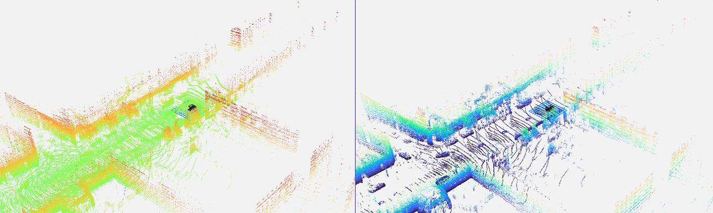
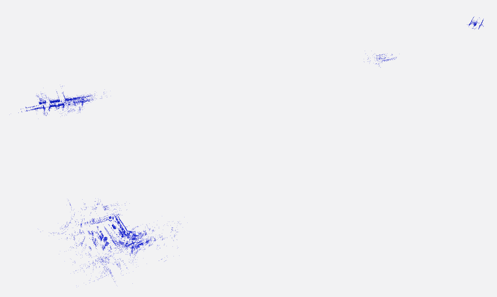

# Autonomous Fleet Mapping

---

*From LiDAR to OctoMap. Scene 0103 - (nuScenes dataset)*


## 1. Summary / Overview
This project is an exploration into the systems architecture required for Autonomous Fleet Mapping. It explores the challenges of ingesting and filtering sensor data across a distributed ROS 2 network.

I orchestrate the telemetry of multiple edge-vehicles driving asynchronous routes, simulated with a mini sample of the nuScenes dataset, and consolidate the raw `sensor_msgs/PointCloud2` topics into a centralized map panel in Foxglove Studio. Because each vehicle's data is mathematically aligned to a global coordinate frame, the pipeline can seamlessly stitch these disparate sensor sweeps into a unified 3D map of the city (Boston Seaport area).

**Technologies Used:** ROS 2 (Jazzy), OctoMap (3D Voxel Mapping / PointCloud2), nuScenes (Autonomous Driving Dataset), MCAP, Foxglove Studio


## 2. LiDAR to OctoMap (Edge Processing)

Exploring the nuScenes dataset gives an appreciation for the sheer volume of high-resolution, multi-modal data available. By synchronizing the `CAM_FRONT` dashcam alongside the 3D LiDAR point cloud, you can physically visualize the massive amount of raw telemetry generated by a single edge vehicle every second:


*Sensor Occlusion: We can see the shadow of the LiDAR behind the cars that drive past*

### Filtering & Tuning
However, feeding this raw, unfiltered data directly into the default `octomap_server` in ROS 2 leads to an incredibly busy and noisy OctoMap (especially on the ground surface). To ensure a highly performant and clean HD map, I tuned three spatial filters:



* **`occupancy_min_z: 0.3` (The Ground Filter):** Raw LiDAR inherently maps the driveable road surface as a solid 3D barrier. Clipping everything below 30cm instantly deletes the road, dropping millions of useless floor voxels without burning heavy CPU cycles on Planar Segmentation algorithms.
* **`occupancy_max_z: 20.0` (The Sky Filter):** Clips out high-altitude laser reflections (like glass skyscrapers) that create floating "ghost" voxels in the sky.  This also results in a different color gradient. 
* **`sensor_model/max_range: 40.0` (The Radius Filter):** Truncates any points beyond 40 meters, keeping the map dense and deleting long-range, low-confidence scatter.


**Voxelization (Cubes vs Points):** `octomap_server` publishes the map in two formats simultaneously. The `MarkerArray` of solid cubes is computationally heavy. The `PointCloud2` of exact center-points is a lightweight "Machine API" optimized for downstream Nav2 path planners. We primarily utilize the PointCloud format as it is highly performant on a local machine.


## 3. Converging Fleet to Global OctoMap

### Architecture Trade-Offs
Scaling a mapping pipeline from a single car to a global fleet presents critical tradeoffs between Network Bandwidth and Cloud Compute. There were three primary architectural approaches to consider:

* **Approach A: Centralized Cloud Mapping (Naive):** Every car blindly transmits its raw 20Hz `PointCloud2` data and Odometry to a central cloud server running a single, massive `octomap_server`.
   * *Verdict:* Commercially non-viable. Sending raw LiDAR data over 5G for an entire fleet would instantly saturate the network and incur astronomical bandwidth costs.

* **Approach B: Edge Mapping + Cloud Merging (Distributed):** Each car runs `octomap_server` locally on its own edge-compute to compress LiDAR into a binary voxel map. It then transmits these highly-compressed map diffs to a custom Cloud Aggregator node that mathematically stitches the overlapping maps together.
   * *Verdict:* Solves the bandwidth problem, but requires heavy custom backend engineering to merge coordinate frames on the server.

* **Approach C: Edge Mapping + Implicit Client Merging (Foxglove):** We compute the OctoMap locally on the edge (like Approach B), but instead of relying on a custom Cloud Aggregator, we use the Visualization Client (Foxglove) to implicitly merge them. By mathematically locking every vehicle's Odometry TF to a shared global `map` frame *before* it leaves the car, Foxglove Studio acts as a zero-code Cloud Orchestrator—seamlessly overlaying all independent edge-maps onto a single, unified coordinate system without requiring any secondary stitching algorithms.
   * *Verdict:* **Chosen Approach.** Zero custom cloud-stitching code required. Extremely fast to prototype and highly performant.


### Fleet Mapping (4 Vehicles)

Here is the consolidated Fleet Map showing 4 completely independent nuScenes logs (`scene-0103`, `scene-0553`, `scene-0655`, and `scene-0061`). 


When you zoom out from the individual agents, you can clearly see the consolidated global OctoMap.  With just 4 scenes, it appears sparse, but demonstrates the foundational architecture for a massive global fleet.



## 4. Quick Start

**Prerequisites:**
You must have the `nuscenes-devkit` Python package installed (`pip install nuscenes-devkit`) and the [nuScenes v1.0-mini dataset](https://www.nuscenes.org/download) downloaded. By default, the node looks for the dataset at `/ros2_ws/data_pipeline/nuscenes2mcap/data`, but you can override this by passing `data_root:=/your/path` to the launch files.

**1. Launch a Single Vehicle (Scene 0103)**
```bash
colcon build --packages-select fleet_mapper
source install/setup.bash
ros2 launch fleet_mapper single_scene_mapping.launch.py
```

**2. Launch the Global Fleet (4 Vehicles Simultaneously)**
```bash
colcon build --packages-select fleet_mapper
source install/setup.bash
ros2 launch fleet_mapper fleet_mapping.launch.py
```

## 5. Development Notes

*This architecture was rapidly prototyped using the Google Antigravity (`agy`) agentic coding assistant to accelerate ROS 2 boilerplate generation and Python orchestration.*
